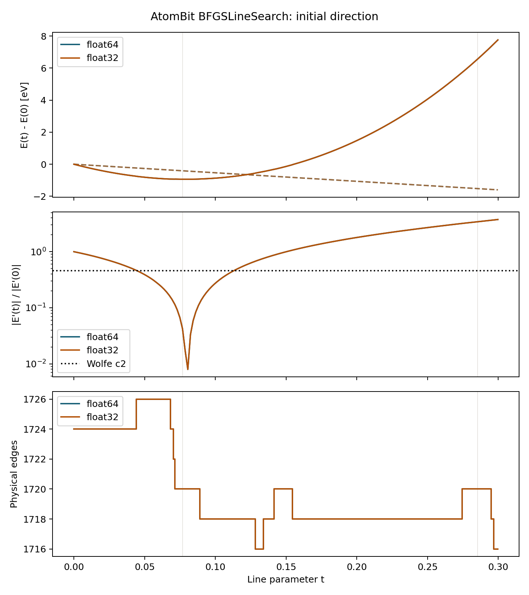
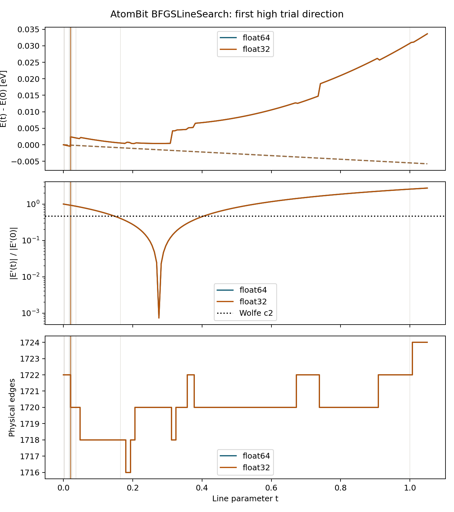
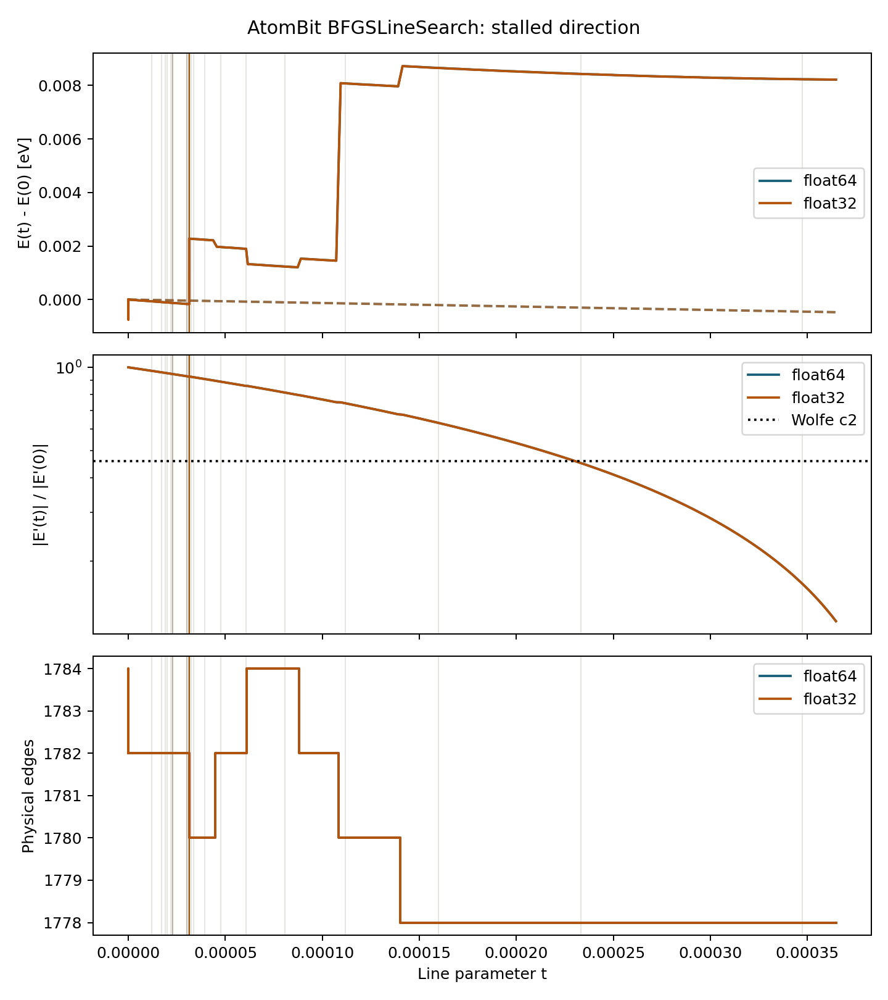

# AtomBit BFGSLineSearch precision diagnostic

## Question

Does converting the complete AtomBit inference and optimization path from
float32 to float64 resolve the excessive strong-Wolfe trial evaluations seen
for H46 variable-cell optimization?

## Protocol

Stage 1 isolates `Aven12_1_367_z1.cif`, reported as system 13 in the failed
H46 R32 active-batch run. Sequential ASE and active batched B1 are each run in
float32 and float64. All optimizer state is float64 so the controlled variable
is model, graph, autograd, energy, force, and stress evaluation precision.

If float64 passes Stage 1, Stage 2 compares sequential ASE and active B32 on
the original frozen H46 R32 pool. Runs use one deterministic timing observation,
`fmax=0.05 eV/A`, at most 500 accepted steps, `alpha=10`, and `maxstep=0.2 A`.

Float64 evaluation does not recover information absent from checkpoint weights;
it tests whether higher-precision execution and reductions stabilize the line
search.

## Results

The dtype audit confirmed that every floating model parameter and buffer, the
positions and cells, and the energy, force, and stress outputs were float64.

| Method | Model dtype | Time (s) | Model evals | Evals/step | Steps | Converged | Final fmax (eV/A) |
|---|---|---:|---:|---:|---:|---|---:|
| ASE | float32 | 357.80 | 19,623 | 39.25 | 500 | no | 0.484 |
| ASE | float64 | 349.00 | 18,903 | 37.81 | 500 | no | 0.703 |
| Active B1 | float32 | 414.25 | 13,299 | 26.60 | 500 | no | 0.999 |
| Active B1 | float64 | 307.69 | 9,661 | 19.32 | 500 | no | 0.824 |

Float64 reduced active-B1 model evaluations by 27.4% and wall time by 25.7%,
but did not restore convergence. Both ASE and batched implementations exhausted
500 accepted steps well above `fmax=0.05 eV/A`. In contrast, standard batched
BFGS converged this structure in 139 steps at float32.

The precision hypothesis is therefore rejected: float32 rounding contributes
to excessive trial work, but is not the root cause. Stage 2 R32 timing was
skipped because its declared B1 convergence gate failed; timing a known
non-convergent method would not be a valid speed comparison.

## Directional-Derivative Diagnostic

The follow-up diagnostic compares the analytic `gradient . direction` against
central energy differences for atomic-only, cell-only, and combined
generalized-force directions. It tests both the initial geometry and the
stalled active-float64 endpoint, in float32 and float64. Cached candidate edges
and forced neighbor rebuilding are measured separately, with candidate and
physical edge counts recorded at every displacement.

The analytic derivatives pass. The best relative errors under normal forced
neighbor rebuilding are:

| Geometry | Dtype | Atomic | Cell | Combined |
|---|---|---:|---:|---:|
| Initial | float32 | 8.11e-5 | 1.64e-5 | 1.02e-4 |
| Initial | float64 | 8.03e-11 | 1.02e-10 | 6.27e-11 |
| Stalled | float32 | 4.94e-5 | 3.46e-3 | 4.47e-5 |
| Stalled | float64 | 3.59e-11 | 9.83e-10 | 4.67e-10 |

Cached and rebuilt float64 energies differ by at most `8.0e-15 eV`, excluding
a neighbor-builder inconsistency. In float32, their maximum difference is
`2.86e-6 eV`; dividing this quantization/reduction-order noise by very small
trial steps makes directional estimates unreliable.

Physical edge transitions occur at normalized steps 0.1 and 0.03 initially,
and 0.1, 0.03, and 0.01 at the stalled geometry. For the stalled float64 cell
direction, the corresponding finite-step deviations from the local derivative
are 45.1%, 85.8%, and 44.7%. Once the physical edge count is stable, the error
falls to `4.34e-6` at step 0.003 and then converges toward zero.

Therefore, neither an incorrect force/stress gradient nor the neighbor-list
builder explains the failure. The line-profile diagnostic below identifies why
the physical edge transitions are not smooth despite the polynomial envelope.

## Actual Line Profiles

The production float64 BFGSLineSearch trajectory was traced for all 500 steps.
All directions were descent directions, but only 117 searches converged; 383
ended with ASE warnings. The median search used 16 model trials, the maximum
used 67, and the median step accepted after a warning was only `1.14e-8`.

The initial direction is well behaved and converges after two trials:



At step 26, the search performs 49 trials and finds no sampled point satisfying
both strong-Wolfe conditions. Across a parameter interval of only `4.02e-7`,
two directed physical edges disappear and the float64 energy jumps by
`2.875 meV`:



At stalled step 420, 56 trials collapse around a boundary only `1.06e-11`
wide. Removing two directed edges jumps the float64 energy by `2.447 meV`; the
search terminates with `WARNING: XTOL TEST SATISFIED`:



The original AtomBit model computes

```text
degree_i = sum_j 1
messages_i = sum_j message_ij / sqrt(degree_i)
```

Although `message_ij` approaches zero smoothly at 6 A, that edge still counts
as one neighbor. When it is removed, `degree_i` changes discontinuously and
rescales every other message on atom `i`. This occurs in float64 as well as
float32, so training or inference precision is not the root cause.

## Degree Counterfactual

We tested the proposed cause directly, rather than relying only on finite
differences or the correlation with edge count. At each of the two cutoff
crossings above, the model was evaluated at identical coordinates with the
crossing edge pair first retained and then removed. The comparison was repeated
while forcing both graphs to use the same inverse-square-root degree.

| Optimizer step | Edge envelope before removal | Topology effect (eV) | Effect with fixed degree (eV) |
|---:|---:|---:|---:|
| 26 | 1.22e-15 | 2.875226e-3 | 0.0 |
| 420 | 1.11e-16 | 2.446745e-3 | 0.0 |

The crossing messages are already numerically zero, yet removing their two
directed edges changes the energy by several meV. Holding degree fixed removes
the topology effect exactly in float64 at both independent crossings. This
establishes hard neighbor-count normalization as the cause of the measured
discontinuity.

A conventional local finite-difference check does not necessarily cross a
cutoff, so it can correctly validate the derivative within one fixed topology
while missing this discontinuity. Finite differences do expose the problem
when their two endpoints straddle the cutoff, as the line profiles do.

The issue is also present while training the original architecture, but normal
parameter optimization does not move coordinates through the cutoff: each
training forward/backward pass uses one fixed graph. Force autograd likewise
differentiates the energy conditional on that graph and omits the discrete
edge-addition/removal event. Unless the data and loss explicitly constrain
paired geometries on both sides of the cutoff, good energy and force losses do
not guarantee cutoff continuity. Training in float64 cannot correct the hard
count; changing the normalization requires retraining or fine-tuning.

For the existing checkpoint, standard BFGS or FIRE is the practical workaround.
The model-level correction is fixed average-neighbor normalization or a smooth
envelope-weighted degree, followed by retraining or fine-tuning because changing
normalization changes the learned potential. The discontinuity must also be
considered before AtomBit NVE molecular dynamics because it can cause energy
jumps when pairs cross the cutoff.
